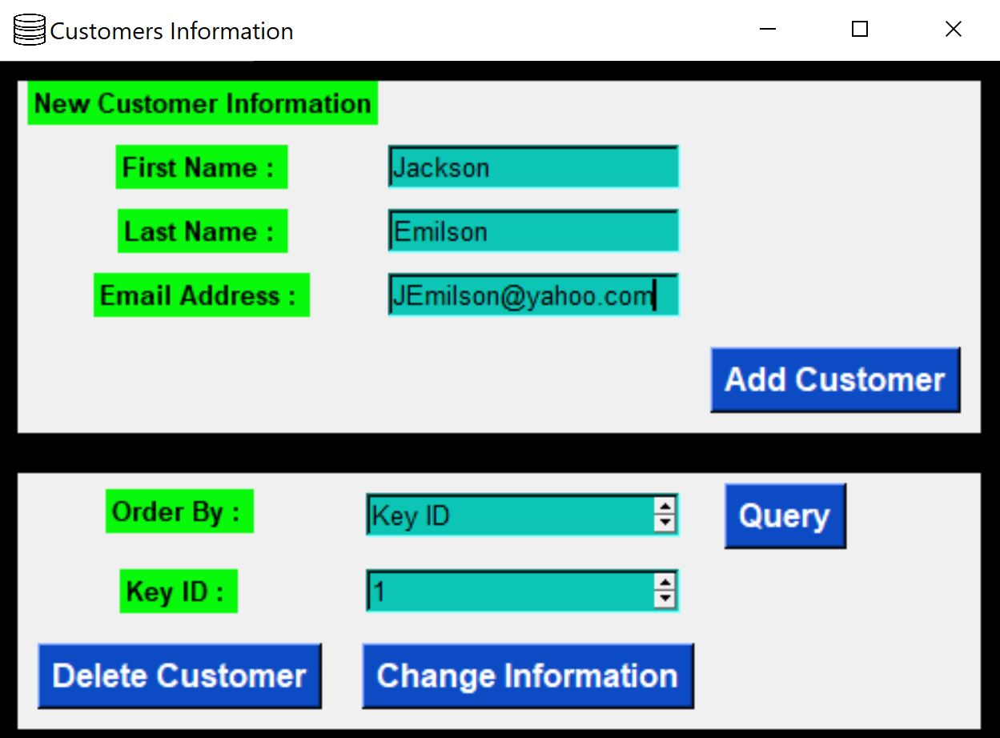
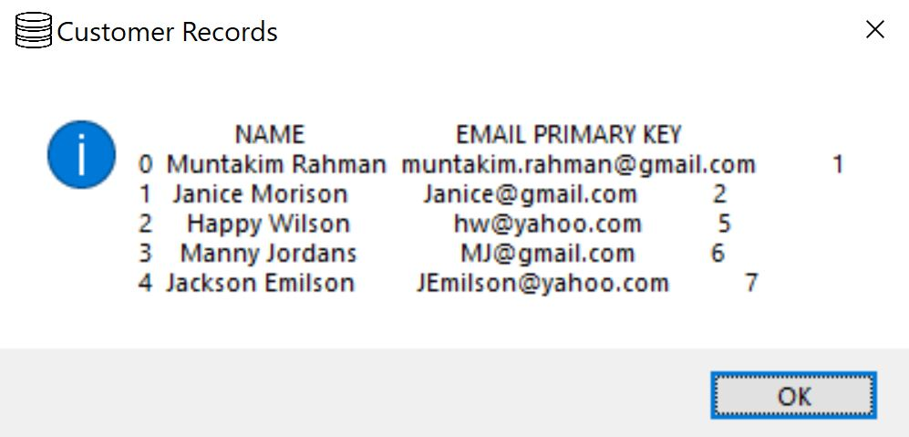

# Electrical Company

## Contents
* [Overview](#Overview)
* [App Modifications](#App-Modifications)
* [Tkinter GUI](#Tkinter-GUI)
    * [Further Exploration](#Further-Exploration)

## Overview

Create <b>Desktop Application</b> driven by <b>Python</b> to collect user data and store in local database. 

## App Modifications

### Tkinter GUI

We used the <b>Tkinter</b> standard interface to create the <b>GUI</b> for the user to interact with when running the application.

The [(`app.py`)](app.py) <b>Python</b> file must be run to add, delete, or modify customers. This can be done as shown below.

We can also query the database and view information for all individuals in some specified order.

### Further Exploration

We are considering developing a system to simulate an income flow for the **Electrical Company**. This will involve time based finance
table updates.

### Tasks

<ul>
    <li>
        <b>GUI</b>
        <ul>
            <li>
                FinancesPage Should Have Data Graphics (Use Matplotlib).
            </li>
        </ul>
    </li>
    <li>
        <b>Time Simulation</b>
        <ul>
            <li>
                Calculate Income From All Customers.
                <ul>
                    <li>Basic (Multiplication Factor of 1)</li>
                    <li>Premium (Multiplication Factor of 1.5)</li>
                </ul>
            </li>
            <li>
                Calculate Monthly Wage to Pay Employees.
                <ul>
                    <li>Fixed Wages Are Acquired From DB Table.</li>
                    <li>
                        Additional Wages Calculated As:
                        <ul>
                            <li>Sales Department Adds New Customers and Receive Commision</li>
                            <li>Corporate Department Employees receive $100 for every $1000 Net Income.</li>
                            <li>Technical Department Workers Get a Bonus Every Quarter (4 Months) Based on Job Title.</li>
                        </ul>
                    </li>
                </ul>
            </li>
        </ul>
    </li>
</ul>